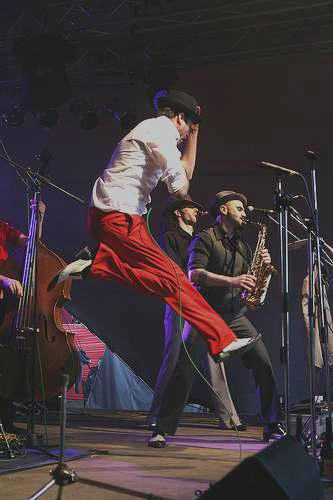

# ICAN | Image Color Adjusting Network

Using machine learning to automatically adjust an image color and lighting:
- [x] Brightness
- [x] Contrast
- [ ] Saturation
- [ ] Color balance
- [ ] etc.

## Dataset
The dataset [MIRFLICKR-25000](https://press.liacs.nl/mirflickr/) is used to synthesize the training data for this project. MIRFLICKR-25000 contains 25000 RGB color JPG images downloaded from Flickr (a photography website) under Creative Commons (CC) license, based on high [interestingness](https://www.flickr.com/explore/interesting) rating and all images are labeled. 

In this project, the provided labels are not used, however the fact that the images were selected by interestingness means they should have decent color and lighting.

## File structure
```
    ican
        |_data
        |   |_mirflickr25k          # raw images
        |   |_synthesized_data      # synthesized images
        |   |_data_loader.py        # image load script
        |   |_data_synthesizer.py   # image synthesize script
        |
        |_ml_core
        |   |_checkpoints           # saved checkpoints
        |   |_models.py             # neural network model definitions
        |   |_train.py              # model train script
        |
        |_output                    # output of run script
        |
        |_run.py                    # main run script
```

## Dependencies
- Python 3.x
- Python libraries
    - numpy
    - pillow
    - sklearn
    - keras
    - tensorflow
    - matplotlib
    - pickle

## Usage guide
1. Install required dependencies
1. Download [MIRFLICKR-25000](https://press.liacs.nl/mirflickr/) dataset and move the `*.jpg` images to [`data/mirflickr25k`](data/mirflickr25k)
1. Run [`data/data_synthesizer.py`](data/data_synthesizer.py) to synthesize training data. synthesized images will be saved at [`data/synthesized_data`](data/synthesized_data)
1. Run [`run.py`](run.py) to begin training. Trained model weights will be saved at [`ml_core/checkpoints`](ml_core/checkpoints)

## Theory
### Color adjusting
Predict color adjustment values based on input image.

### Color matching
Apply color adjustment values of one image to the other adjusted image.


## Training process

## Test results
Original image | Synthesized image | Adjusted image
:---:|:---:|:---:
||